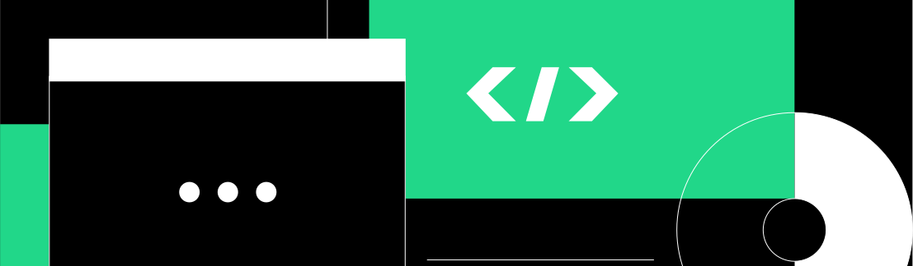

# Accessibility Enhancements for Qodana Reports
# JetBrains Internship Project 2024

How to run this project repo locally

This project was bootstrapped with [Create React App](https://github.com/facebook/create-react-app).

In the project directory, you can run:

### `npm start`

Runs the app in the development mode.\
Open [http://localhost:3000](http://localhost:3000) to view it in your browser.

The page will reload when you make changes.\
You may also see any lint errors in the console.

Preview in CodeSandBox: 

## Task Description
Design and develop an accessible registration form with fields for email, password, and username, plus a "Show Password" toggle button, ensuring keyboard navigability and screen reader compatibility.

## Solution outcome
Working on this task has provided me with a unique opportunity to improve my skills in React, specifically with the React Hook Form library. Through hands-on experience, I've deepened practical knowledge in frontend development and UX. 
As I delved into the WCAG 2.1 guidelines, I've not only learned about the importance of inclusive design but also applied these principles directly to my project. 

## Results: Registration Form with keyboard navigability and screen reader compatibility
screenshots

## Project compatibility with  [WCAG 2.1](https://www.w3.org/TR/WCAG21/)
This section showcase my interest in Web Content Accessibility Guidelines.
I scanned all sections of WCAG 2.1 and checked "How to Meet ..." suggestions for relevant features within this task.

### Perceivable
add points here

### Operable
[Keyboard accessible](https://www.w3.org/TR/WCAG21/#keyboard-accessible)

[Focus Order](https://www.w3.org/TR/WCAG21/#focus-order)

[Headings and Lables](https://www.w3.org/TR/WCAG21/#headings-and-labels)

[Focus Visible](https://www.w3.org/TR/WCAG21/#focus-visible)

### Understandable
add points here

### Robust
add points here